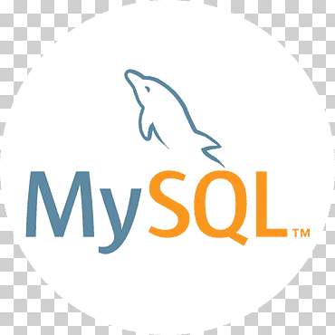

### Hi there 👋

#### I'm Rustam, a QA Engineer

```
I have experience in:
• Writing test documentation
• Writing simple SQL queries
• Testing REST API (Postman, Swagger)
• Applying test design techniques at work
```

<!--
**rustamd74/rustamd74** is a ✨ _special_ ✨ repository because its `README.md` (this file) appears on your GitHub profile.

Here are some ideas to get you started:

- 🔭 I’m currently working on ...
- 🌱 I’m currently learning ...
- 👯 I’m looking to collaborate on ...
- 🤔 I’m looking for help with ...
- 💬 Ask me about ...
- 📫 How to reach me: ...
- 😄 Pronouns: ...
- ⚡ Fun fact: ...
-->

<!--Stack and tools-->

&#8287;&#8287;&#8287;&#8287;&#8287;

## :computer:Stack and tools

<p  align="center">
  <code></code>
  <code></code>
  <code></code>
  <code></code>
  <code></code>
  <code></code>
  <code></code>
  <code></code>
  <code></code>
  <code></code>
  <code></code>
  <code></code>
  <code></code>
  <code></code>
  <code></code>
  <code></code>
  <code></code>
  <code></code>
  <code></code>
  <code></code>
  <code></code>
  <code></code>
  <code></code>
  <code></code>
  <code></code>
  <code></code>
</p>
<!--Git Stats-->

&#8287;&#8287;&#8287;&#8287;&#8287;

## :bar_chart:Git stats


## Дипломный проект

Реализован во время обучения в Школе инженеров по автоматизации тестирования <a target="_blank" href="https://qa.guru">
qa.guru</a>

## Тестирование UI

:link: Тестовый проект: <a target="_blank" href= ""></a></br></br>
