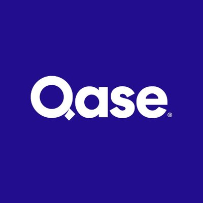
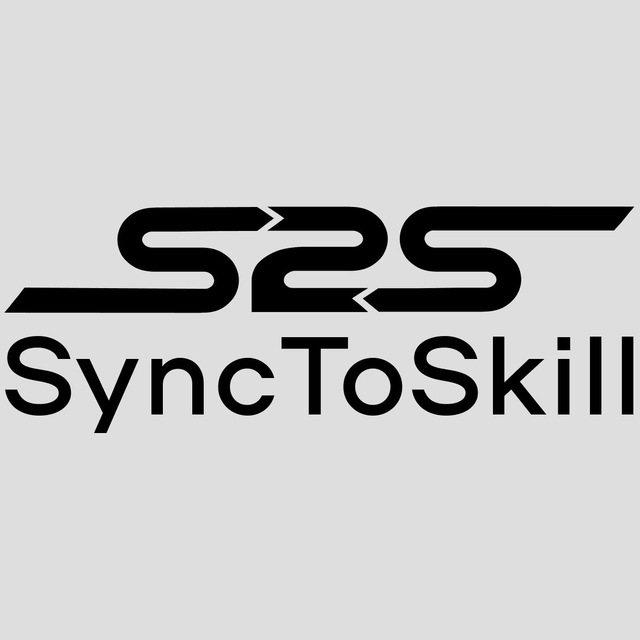
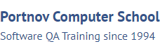

### Hi there 👋

#### I'm Rustam, a QA Engineer
##### I have been working as a QA engineer for 2 years

```
I have experience in:
• Writing test documentation
• Writing simple SQL queries
• Testing REST API (Postman, Swagger)
• Applying test design techniques at work
```

<!--
**rustamd74/rustamd74** is a ✨ _special_ ✨ repository because its `README.md` (this file) appears on your GitHub profile.

Here are some ideas to get you started:

- 🔭 I’m currently working on ...
- 🌱 I’m currently learning ...
- 👯 I’m looking to collaborate on ...
- 🤔 I’m looking for help with ...
- 💬 Ask me about ...
- 📫 How to reach me: ...
- 😄 Pronouns: ...
- ⚡ Fun fact: ...
-->

<!--Stack and tools-->

&#8287;&#8287;&#8287;&#8287;&#8287;

## :computer:Stack and tools

<p  align="center">
  <code></code>
  <code></code>
  <code></code>
  <code></code>
  <code></code>
  <code></code>
  <code></code>
  <code></code>
  <code></code>
  <code></code>
  <code></code>
  <code></code>
  <code></code>
  <code></code>
  <code></code>
  <code></code>
  <code></code>
  <code></code>
  <code></code>
  <code></code>
  <code></code>
  <code></code>
  <code></code>
  <code></code>
  <code></code>
  <code></code>
</p>
<!--Git Stats-->

&#8287;&#8287;&#8287;&#8287;&#8287;

## :bar_chart:Git stats


[//]: # (## :man_student:Education)

[//]: # (<table width="100%" border='0'>)

[//]: # (   <tr> )

[//]: # (    <td width="30%" valign="bottom"></td><td valign="middle">National Research Mordovian State University named after N.P. Ogarev. Direction - Mechanic technician.</td></tr>)

[//]: # (  </table>)

[//]: # (  </br>)

[//]: # ()
#### Additional Education:

<table width="100%" border='0'>
   <tr><td width="20%" valign="bottom"></td><td 
valign="middle">Geek Brains <a target="_blank" href="https://gb.ru/courses/testing">Geek Brains</a>.</td></tr>

   <tr><td width="30%" valign="bottom"></td><td 
valign="middle">qa.synctoskill <a target="_blank" href="https://qa.synctoskill.com/course">Sync to skill</a>.</td></tr>
   </tr>

   <tr><td width="30%" valign="bottom"></td><td 
valign="middle">Portnov Computer School <a target="_blank" href="https://www.portnov.com">portnov.com</a>.</td></tr>

   <tr><td width="30%" valign="bottom"></td><td valign="middle">School of Test Automation Engineers <a target="_blank" href="https://qa.guru">qa.guru</a>.</td></tr>
   </tr>
  </table>

## Graduation project

Implemented while studying at the School of Test Automation Engineers <a target="_blank" href="https://qa.guru">
qa.guru</a>

### [Testing UI](https://github.com/rustamd74/demoqa-tests-jenkins/tree/notifications/README.md) 

### [Testing API and combined UI with API](https://github.com/rustamd74/qa_guru_diplom_api#readme) 

### [Testing mobile](https://github.com/rustamd74/qa_guru_diplom_mobile/blob/mac_or_linux/README.md)
